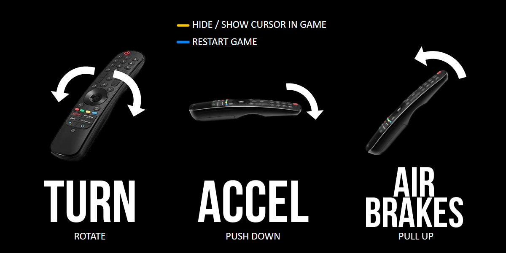
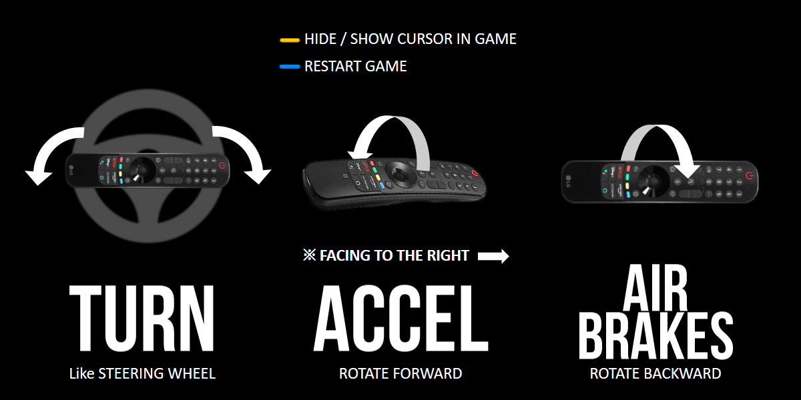

# HexGL

Source code of [HexGL](http://hexgl.bkcore.com), the futuristic HTML5 racing game by [Thibaut Despoulain](http://bkcore.com)

## Branches

- **[Master](https://github.com/BKcore/HexGL)** - Public release (stable).

## License

Unless specified in the file, HexGL's code and resources are now licensed under the _MIT License_.

## Installation

    cd ~/
    git clone git://github.com/BKcore/HexGL.git
    cd HexGL
    python -m SimpleHTTPServer
    chromium index.html

To use full size textures, swap the two textures/ and textures.full/ directories.

## Note

The development of HexGL is in a hiatus for now until I find some time and interest to work on it again.
That said, feel free to post issues, patches, or anything to make the game better and I'll gladly review and merge them.

=========

# HexGL by LG Electronics

## License

Unless specified in the file, modified by LGE code and resources are now licensed under the _MIT License_.

## Description

You can play the game using LG TV MRCU(Magic Remote Control Unit)<br/>
<br/>
There are two ways:<br/>
Handhold mode, which uses the MRCU in the direction of the screen,<br/>
and Steering Wheel mode, which uses the MRCU parallel to the screen and rotates it like a steering wheel.<br/>

### Handhold Mode

<br/>

### Steering Wheel Mode

<br/>

## Requirements

- webOS24 latest version and higher
- MRCU pairing

## How to Use the Samples

### Clone the Repository

Clone the repository and cd into the cloned directory.

```
git clone http://mod.lge.com/hub/advprod-swdev-app/com.game.app.hexgl.git (TODO - git open source link)
cd com.game.app.hexgl
```

### App Package & Install

Package this project and install it on TV.

https://webostv.developer.lge.com/develop/tools/cli-dev-guide#ares-package</br>
https://webostv.developer.lge.com/develop/tools/cli-dev-guide#ares-setup-device</br>
https://webostv.developer.lge.com/develop/tools/cli-dev-guide#ares-install</br>

## Luna Servcie API - MRCU Service

If you want to see details about the MRCU Service API, please refer to this url. <br />

developer site Link --- TODO


